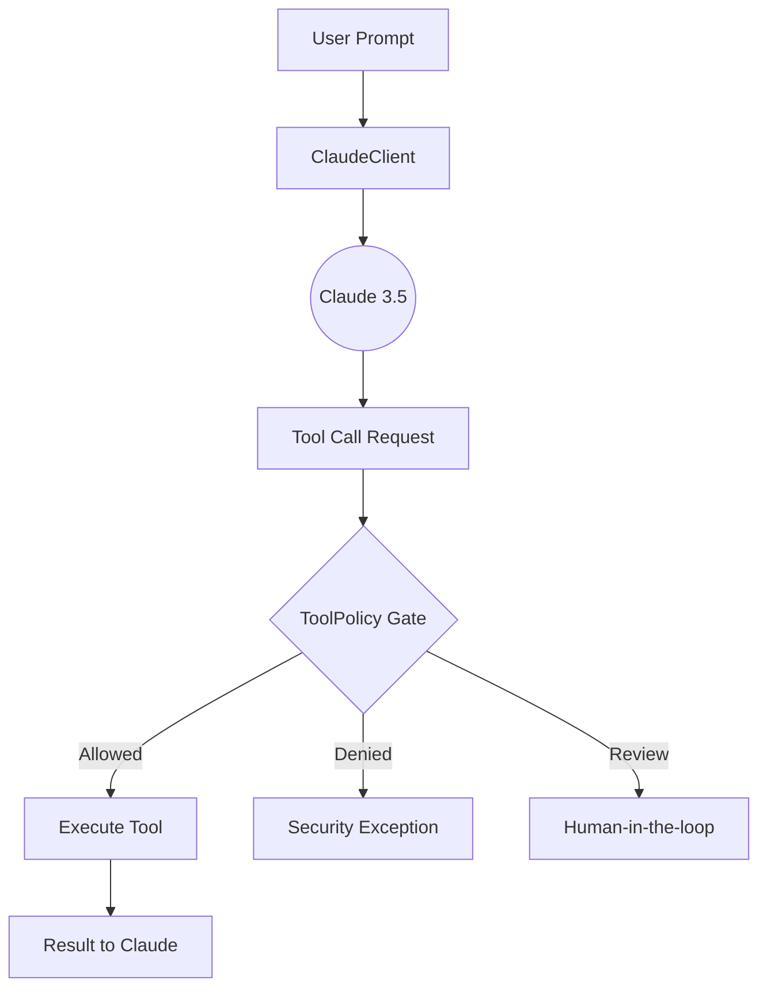

# 🤖 Claude Agent Core

[](https://github.com/Informant254/claude-agent-core/stargazers)
[](https://opensource.org/licenses/MIT)
[](https://www.python.org/downloads/)
[](https://www.anthropic.com/claude)
[](https://github.com/Informant254/claude-agent-core)

**High-performance, lightweight Python primitives for building Claude-powered agents with explicit input validation and zero-trust tool policy gates.**


## 🌟 Why Claude Agent Core?

While large frameworks like LangChain or CrewAI offer extensive features, they often come with significant overhead and "black-box" safety decisions. **Claude Agent Core** is built for developers who demand:

- **Absolute Control**: Explicitly gate every tool call before it hits your production environment.
- **Claude Optimization**: Specifically tuned for Claude 3.5 Sonnet's unique prompt structures and tool-calling capabilities.
- **Zero Dependencies**: A thin, readable foundation that won't bloat your project.
- **Security-First**: Built-in validation for prompts, token counts, and tool arguments.

---

 readme-improvements
In the rapidly evolving landscape of AI agents, ensuring security and predictable behavior is paramount. `claude-agent-core` addresses this critical need by providing a minimalist, auditable foundation for building Claude-powered agents. It empowers developers to implement robust safety measures, preventing unintended actions and maintaining control over agentic workflows. Unlike larger frameworks that might obscure security-critical logic, `claude-agent-core` offers transparent policy enforcement and explicit input validation, making it ideal for applications where trust and reliability are non-negotiable.


## 🛠️ Quick Start

Getting started with `claude-agent-core` is straightforward. Follow these steps to integrate secure AI agent capabilities into your Python projects.


## 🏗️ Architecture: The Policy Gate

Claude Agent Core introduces a **Policy Layer** that sits between the LLM and your external tools. This ensures that even if an LLM is "hallucinating" or being manipulated, your system remains secure.



---

## 🛠️ Quick Start

main
### Installation

```bash
pip install git+https://github.com/Informant254/claude-agent-core.git
```

### Basic Usage

readme-improvements
Here's how to make a basic call to the Claude API with built-in validation:
```python
from claude_agent_core.client import ClaudeClient

client = ClaudeClient(api_key="your-anthropic-api-key") # Ensure your API key is securely managed
response = client.generate_response("Explain quantum computing in simple terms.")
print(response)
```

### Policy-Driven Tool Calls

One of the core strengths of `claude-agent-core` is its ability to gate tool calls based on predefined policies, ensuring that your agent's actions are always within acceptable boundaries. This example demonstrates how to set up a `ToolPolicy` to control tool execution:

```python
from claude_agent_core.client import ClaudeClient

# Initialize the client (looks for ANTHROPIC_API_KEY in env)
client = ClaudeClient()

response = client.generate_response("Draft a security policy for a small startup.")
print(response)
```

### Implementing a Zero-Trust Tool Policy
 main
```python
from claude_agent_core.policy import ToolPolicy

# Define your safety boundaries
policy = ToolPolicy(
readme-improvements
    allowed_tools={"search_docs", "summarize_file"}, # Only allow these tools
    confirmation_required={"summarize_file"}, # Require human confirmation for sensitive actions
    max_argument_bytes=4096, # Limit the size of tool arguments to prevent abuse
)

# Example: Evaluating a tool call
decision = policy.evaluate("summarize_file", {"path": "SECURITY.md"})

if decision.allowed and not decision.requires_confirmation:
    print("Tool call is safe to execute.")
elif decision.requires_confirmation:
    print(f"Tool call requires human confirmation: {decision.reason}")
else:
    print(f"Tool call denied: {decision.reason}")
```

This policy layer acts as a crucial safeguard, allowing you to define explicit boundaries for your agent's autonomy.


## 🔐 Security Notes

- Keep API keys out of source control. Use environment variables or a local `.env` file.
- The client validates prompts and token counts before sending a request.
- `.env` loading is optional at runtime and no longer happens at import time.
- For tests or dependency injection, you can pass a preconfigured SDK client into `ClaudeClient`.
- Tool policies can enforce allowlists, denylists, confirmation gates, and argument size limits.

    allowed_tools={"search_web", "read_file"},
    confirmation_required={"delete_file", "send_email"},
    max_argument_bytes=1024, # Prevent prompt injection via massive arguments
)

# Evaluate a tool call before execution
decision = policy.evaluate("delete_file", {"path": "config.json"})
main

if decision.allowed and decision.requires_confirmation:
    print("⚠️ Action requires human approval!")
```

---

## 📊 Comparison

| Feature | Claude Agent Core | LangChain | CrewAI |
| :--- | :--- | :--- | :--- |
| **Complexity** | Extremely Low | High | Medium |
| **Learning Curve** | 5 Minutes | Weeks | Days |
| **Security Gates** | Native & Explicit | Middleware/Custom | Custom |
| **Claude Optimization** | Primary Focus | General | General |
| **Dependencies** | Minimal | Heavy | Heavy |

---

## 🤝 Contributing & Support

We are building the most secure foundation for AI agents. If you believe in a safer AI future:

readme-improvements
We welcome and appreciate contributions from the community! Whether it's a bug report, a new feature, or an improvement to the documentation, your input helps make `claude-agent-core` better.

Please see our [CONTRIBUTING.md](CONTRIBUTING.md) for detailed guidelines on how to get started.

If you find this project useful, please **give it a ⭐ Star**! It helps us gain visibility and encourages continued development.

1.  **Give us a ⭐ Star** – It helps more developers find this project.
2.  **Fork & Contribute** – Check out our [Good First Issues](https://github.com/Informant254/claude-agent-core/issues).
3.  **Share** – Let others know about a lightweight alternative for Claude agents.
 main

Built with ❤️ by [Informant254](https://github.com/Informant254)
